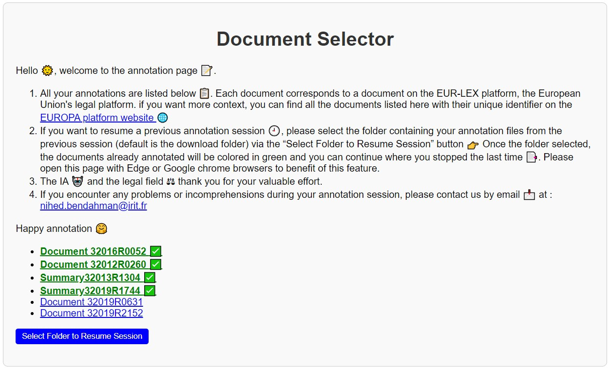
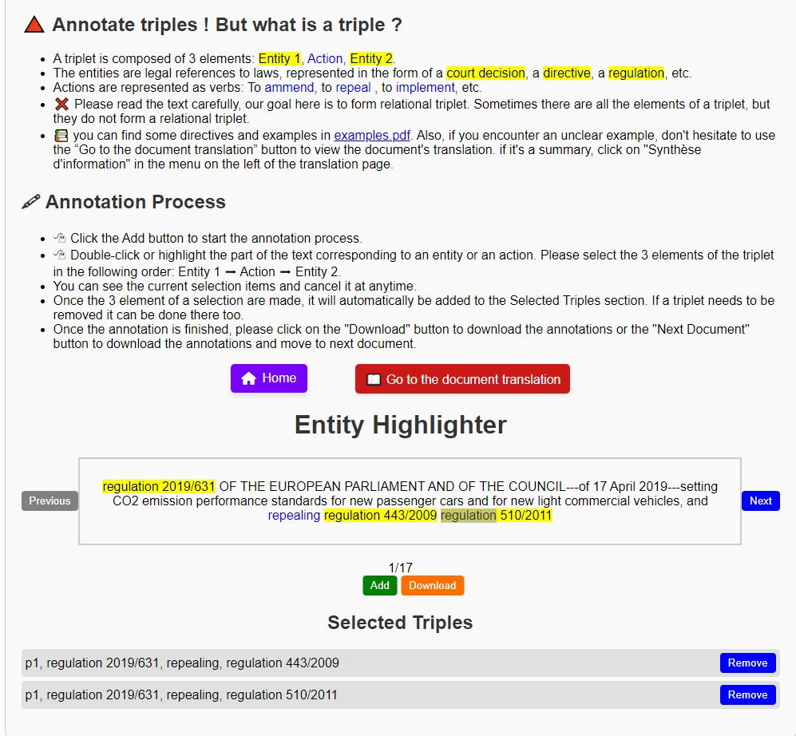

This repository contains an example of an annotation package as given to the annotators:
* `filesystem.js` and `script.js` files contain javascript code of the server.
* `annotation.html` is the annotation homepage, it lists the annotated documents or to be annotated. Here is an example of the annotation homepage:   
* The annotated/to be annotated documents are in [documents](documents). here is an example of document:  
