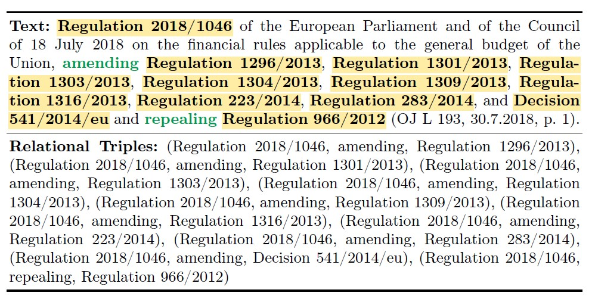

* This repository contains the annotated data.
* The original EUR-Lex-Sum dataset can be found on the HuggingFace Hub : [EUR-Lex-Sum](https://huggingface.co/datasets/dennlinger/eur-lex-sum)
* ```Annotated_Documents``` repository contains all documents of EUR-Lex-Sum, whether annotated or not.
* ```Filtred_Annotated_Documents``` repository contains only the annotated documents (a document is annotated if it contains at least one annotated paragraph. A paragraph is annotated if it contains the necessary elements for, at least, one triple, i.e, 2 entities and 1 verb).
* Each json files includes the following metadata :
* * `Celex-id` : unique EUR-Lex identifier,
  * `Reference`,
  * `Summary`,
  * `Tags` : Keywords document,
  * `Subjects` : Document's Topic,
  * `Reference Annotations` : containing a list of annotated paragraphs of the documents and their triples,
  * `Summary Annotations` : containing a list of annotated paragraphs of the summary and their triples.
## Dataset Description
* EUR-Lex-Triples consists on 1504 annotated documents. All Documents come from the english part of EUR-Lex-Sum Dataset.

* Here is an example of an annotated paragraph of EUR-Lex-Sum with its associated triples : 

* Number of occurrences of different entity and verb types across the dataset in documents (Docs) and summaries (Sums) :
  
|                      |                  | Original Dataset     | Selected Paragraphs   | Annotated Triples      |
|----------------------|------------------|----------------------|------------------------|-----------------------|
|                      |                  | Docs     | Sums       | Docs     | Sums       | Docs     | Sums       |
| **Entity**           | Directive        | 37,563   | 5,841      | 11,898   | 2,448      | 6,720    | 2,501      |
|                      | Decision         | 23,940   | 4,469      | 3,786    | 885        | 1,329    | 854        |
|                      | Regulation       | 54,845   | 10,062     | 12,162   | 4,959      | 11,023   | 6,263      |
|                      | Resolution       | 5,535    | 333        | 275      | 30         | 18       | 12         |
|                      | Recommendation   | 3,548    | 446        | 248      | 5          | 40       | 4          |
|                      | Opinion          | 5,125    | 155        | 866      | 4          | 39       | 3          |
| **Verb**             | To amend         | 2,631    | 1,514      | 1,996    | 1,056      | 5,032    | 2,366      |
|                      | To supplement    | 800      | 274        | 133      | 208        | 85       | 195        |
|                      | To repeal        | 2,517    | 1,204      | 2,397    | 1,036      | 4,021    | 1,872      |
|                      | To replace       | 307      | 225        | 106      | 105        | 152      | 213        |
|                      | To correct       | 84       | 10         | 11       | 4          | 5        | 4          |
|                      | To implement     | 10,826   | 1,652      | 1,394    | 698        | 281      | 158        |
|                      | To recast        | 38       | 61         | 2        | 6          | 5        | 5          |
|                      | To extend        | 464      | 112        | 74       | 15         | 2        | 0          |


* Some statistics of the annotated documents :

| Element                     | Number |
|-----------------------------|---------|
| Annotated paragraphs        | 7,186   |
| No_relation tag paragraphs  | 972     |
| Triples                     | 14,396  |
| Unique triples              | 9,193   |

