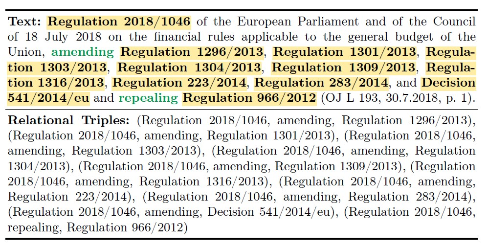
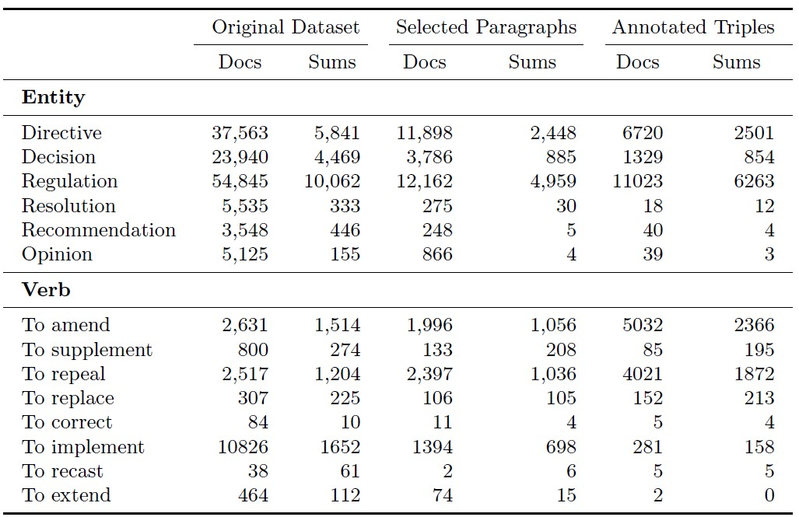
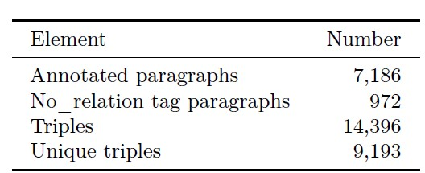

* The original EUR-Lex-Sum dataset can be found on the HuggingFace Hub : [EUR-Lex-Sum](https://huggingface.co/datasets/dennlinger/eur-lex-sum)
* This repository contains the annotated data.
* Each json files contains :
* * `Celex-id` : unique EUR-Lex identifier,
  * `Reference`,
  * `Summary`,
  * `Tags` : Keywords document,
  * `Subjects` : Document's Topic
  * `Reference Annotations` : containing a list of annotated paragraphs of the documents and their triples,
  * `Summary Annotations` : containing a list of annotated paragraphs of the summary and their triples,
## Dataset Description
* EUR-Lex-Triples consists on 1504 annotated documents. All Documents come from the english part of EUR-Lex-Sum Dataset.

* Here is an example of an annotated paragraph of EUR-Lex-Sum with its associated triples : 

* Number of occurrences of different entity and verb types across the dataset in documents (Docs) and summaries (Sums) : 

* Some statistics of the annotated documents :

   
