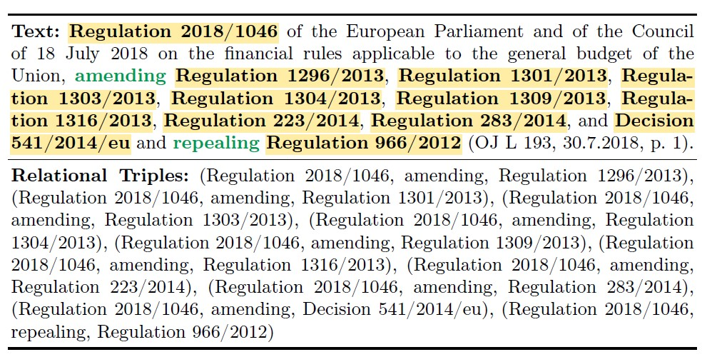

# EUR-Lex-Triples: A Legal Relation Extraction Dataset from European Legislation
EUR-Lex-Sum dataset [Aumiller, 2022](https://aclanthology.org/2022.emnlp-main.519.pdf) annotated with triples

## Dataset Description
* EUR-Lex-Triples consists on 1504 annotated documents. All Documents come from the english part of EUR-Lex-Sum Dataset.
* [Dataset](Dataset) contains json files containing for each document its summary, the annotated paragraphs, and for each paragraph the triples derived from the annotations.

* Here is an example of a document of EUR-Lex-Sum with its associated triples : 

* Number of occurrences of different entity and verb types across the dataset in documents (Docs) and summaries (Sums) : 
  
## Installation
Install all necessary dependencies by running : 
``` python3 -m pip install -r requirements.txt ```

## Data Preprocessing
* [Code/Preprocessing](Code/Preprocessing) contains the code used for the pre-processing of documents for the annotation process.
  
## Annotation Tool
* [Code/Annotation-Tool](Code/Annotation-Tool) contains the code used for the annotation tool we developed as well as the detailed guidelines and some [examples](Code/Annotation-Tool/examples.pdf);
   
## Relation Extraction Baselines
* [Code/RE-Baselines](Code/RE-Baselines) contains the code used to run the RE baselines : Fine-Tuning and Inference.
* Results of baseline models for Relation Extraction are : 
* [Code/RE-Baselines](Code/RE-Baselines/Checlpoints) contains the checkpoints of the fine-tuned models.
## citation
EUR-Lex-Triples: A Legal Relation Extraction Dataset from European Legislation. Nihed Bendahman, Karen Pinel-Sauvagnat, Gilles Hubert and Mokhtar Boumedyen Billami.
Paper submitted to ESWC 2025 Resources Track.
## Licence
Copyright for the editorial content of EUR-Lex website, the summaries of EU legislation and the consolidated texts owned by the EU, are licensed under the Creative Commons Attribution 4.0 International licence, i.e., CC BY 4.0 as mentioned on the official EUR-Lex website. Any data artifacts remain licensed under the CC BY 4.0 license.
